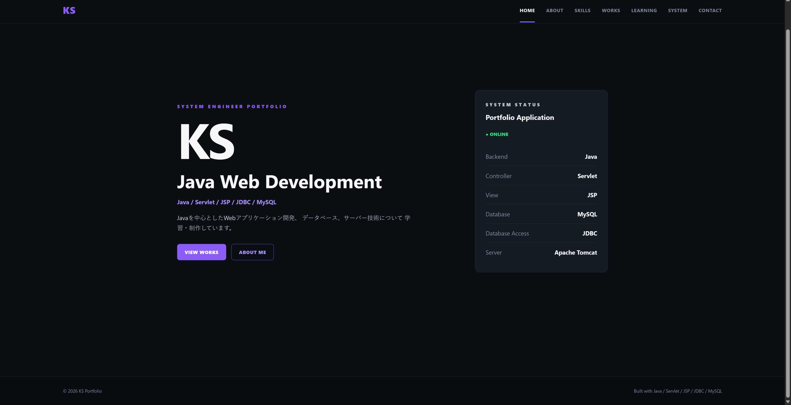

# KS Portfolio

Java / Servlet / JSP / JDBC / MySQL を使用して制作した、
Webアプリケーション形式のポートフォリオサイトです。



制作物を単純なHTMLへ直接記述するのではなく、
MySQLに登録された作品情報をJavaから取得し、
Servlet・JSPを通して動的に表示する構成にしています。

---

## Features

- Java Servletによるリクエスト処理
- JSPによる画面表示
- JDBCによるMySQL接続
- MySQLによる作品データ管理
- 制作物一覧表示
- 制作物詳細表示
- 複数スクリーンショット表示
- 画像ライトボックス
- 前後画像切り替え
- SPA風ページ切り替え
- レスポンシブ対応
- 400 / 404 / 500 エラーページ
- HTMLエスケープによるXSS対策
- 外部URLのHTTP / HTTPS検証
- PreparedStatementによるSQL実行
- 環境変数によるDB接続情報管理
- 最小権限のMySQLユーザーを使用

---

## Technology

### Backend

- Java 17
- Servlet
- JDBC

### Frontend

- JSP
- HTML
- CSS
- JavaScript

### Database

- MySQL 8

### Server

- Apache Tomcat 9

### Development Environment

- Eclipse IDE
- Windows 11

---

## System Architecture

```text
Browser
   ↓
PortfolioServlet
   ↓
WorkRepository
   ↓
JDBC
   ↓
MySQL
   ↓
JSP
   ↓
Browser
```

作品情報はMySQLから取得しています。

Servletがリクエストを受け取り、
Repositoryを通してデータベースへアクセスします。

取得したデータをrequest属性へ格納し、
JSPへforwardして画面を生成します。

---

# Works

## 1. Java Task Management System

Java Servlet / JSP / JDBC / MySQL を使用して制作した
タスク管理Webアプリケーションです。

### Technology

- Java
- Servlet
- JSP
- JDBC
- MySQL
- Apache Tomcat

### Main Features

- ログイン認証
- タスク登録
- タスク一覧
- タスク編集
- タスク削除
- タスクコピー
- キーワード検索
- 並べ替え
- ページング
- カテゴリ管理
- お気に入り
- ダッシュボード
- タスク統計

### Development Points

Servlet・JSP・JDBC・MySQLを組み合わせ、
画面表示からデータベース処理までを
一連のWebアプリケーションとして構築しました。

検索・ページング・カテゴリ・お気に入りなど、
複数の条件を扱う機能の実装にも取り組みました。

---

## 2. VBA Invoice Management System

Excel VBAとUserFormを利用して制作した
請求書作成・管理システムです。

### Technology

- Microsoft Excel
- VBA
- UserForm

### Main Features

- 新規請求書作成
- 請求書検索
- 期間検索
- 取引先検索
- 請求書編集
- 請求書削除
- 請求書生成
- PDF出力
- 取引先マスタ管理
- エラーログ確認
- 検索件数集計
- 合計金額集計

### Development Points

Excelシートを直接操作するだけではなく、
UserFormを利用してメニュー・入力・検索・管理画面を構築しました。

請求書の入力から検索・編集・削除・帳票生成・PDF出力まで、
一連の業務を操作できるシステムとして制作しています。

---

# Database

ポートフォリオに掲載する作品は
MySQLの `works` テーブルで管理しています。

作品ごとのスクリーンショットは
`work_images` テーブルで管理しています。

```text
works
   │
   │ 1
   │
   └──────────── *
             work_images
```

1つの作品に対して、
複数のスクリーンショットを登録できます。

---

# Security

公開を想定し、以下の対策を実装しています。

### Database Credentials

DB接続情報はJavaソースコードへ直接記述せず、
環境変数から取得しています。

使用する環境変数は次の3つです。

```text
PORTFOLIO_DB_URL
PORTFOLIO_DB_USER
PORTFOLIO_DB_PASSWORD
```

※ 実際のユーザー名・パスワード等は
リポジトリへ含めません。

### Least Privilege

Webアプリケーション専用のMySQLユーザーを作成し、
必要最小限の権限でデータベースへアクセスしています。

### SQL Injection

SQL実行には `PreparedStatement` を使用しています。

### XSS

データベースからJSPへ表示する文字列は
HTMLエスケープ処理を行っています。

```java
HtmlUtil.escape(value)
```

### External URL Validation

GitHubやDemoなどの外部URLは
HTTP / HTTPS のみを許可しています。

```java
UrlUtil.safeHttpUrl(value)
```

`javascript:` や `data:` などのURLは許可しません。

### Error Handling

以下の専用エラーページを用意しています。

```text
400 Bad Request
404 Not Found
500 Server Error
```

例外内容やデータベース接続情報などを
ブラウザへ直接表示しない構成にしています。

---

# Project Structure

```text
Portfolio
│
├─ src
│  └─ main
│     │
│     ├─ java
│     │  │
│     │  ├─ controller
│     │  │  └─ PortfolioServlet.java
│     │  │
│     │  ├─ model
│     │  │  ├─ Work.java
│     │  │  └─ WorkImage.java
│     │  │
│     │  ├─ repository
│     │  │  └─ WorkRepository.java
│     │  │
│     │  └─ util
│     │     ├─ HtmlUtil.java
│     │     └─ UrlUtil.java
│     │
│     └─ webapp
│        │
│        ├─ css
│        │  └─ style.css
│        │
│        ├─ js
│        │  └─ app.js
│        │
│        ├─ images
│        │  └─ works
│        │
│        └─ WEB-INF
│           │
│           ├─ web.xml
│           │
│           └─ views
│              ├─ index.jsp
│              ├─ 400.jsp
│              ├─ 404.jsp
│              └─ 500.jsp
│
├─ .gitignore
└─ README.md
```

---

# Local Setup

## 1. Requirements

以下の環境を使用します。

```text
Java 17
Apache Tomcat 9
MySQL 8
Eclipse IDE
```

---

## 2. Database

MySQLにポートフォリオ用データベースを作成します。

```sql
CREATE DATABASE portfolio_db;
```

作品情報を保存する `works` テーブルと、
スクリーンショットを保存する `work_images` テーブルを使用します。

---

## 3. Environment Variables

Tomcatの実行環境へ以下を設定します。

```text
PORTFOLIO_DB_URL
PORTFOLIO_DB_USER
PORTFOLIO_DB_PASSWORD
```

例:

```text
PORTFOLIO_DB_URL=jdbc:mysql://localhost:3306/portfolio_db
PORTFOLIO_DB_USER=your_user
PORTFOLIO_DB_PASSWORD=your_password
```

※ 上記は設定例です。

実際の認証情報をGitHubへ登録しないでください。

---

## 4. Start Tomcat

TomcatへPortfolioプロジェクトを追加して起動します。

ローカル環境では以下からアクセスします。

```text
http://localhost:8080/Portfolio/
```

---

# Error Page Test

400:

```text
?page=detail&id=abc
```

404:

```text
?page=detail&id=999999
```

正常な作品詳細:

```text
?page=detail&id=1
```

---

# Purpose

このポートフォリオでは、
完成した制作物を掲載するだけでなく、

- Java Webアプリケーション
- MVCを意識した構成
- データベース連携
- セキュリティ
- エラーハンドリング
- レスポンシブUI

など、Webシステムを構築する上で必要となる要素を
実際に組み合わせて実装することを目的としています。

---

## Author

KS

---

## Status

Development / Portfolio Project