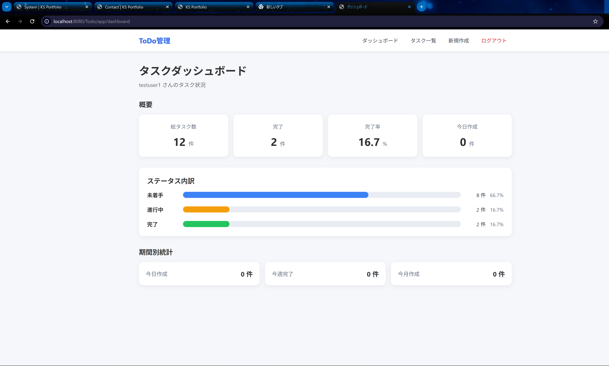
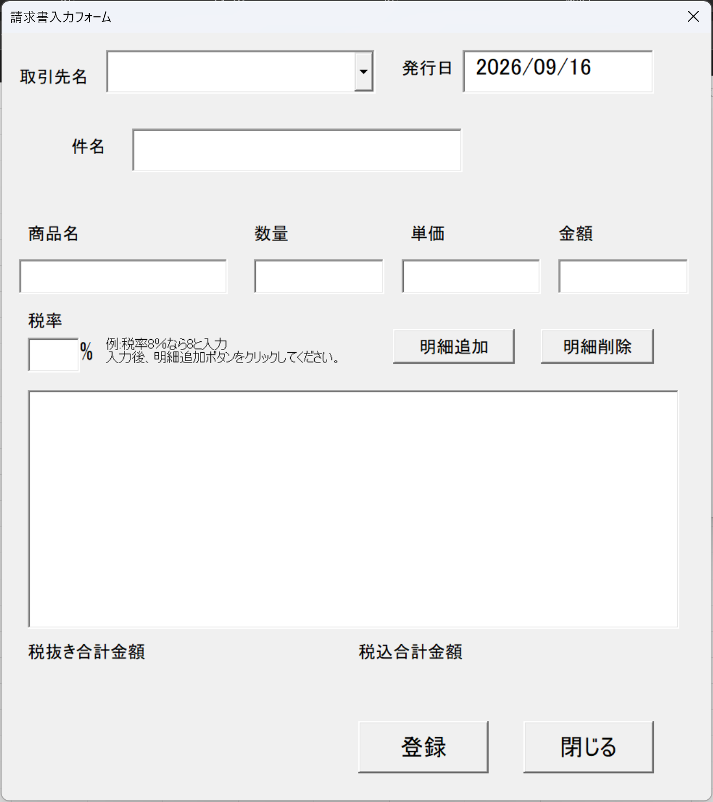

# KS Portfolio

Java / Servlet / JSP / JDBC / MySQL を使用して制作した、  
Webアプリケーション形式のポートフォリオサイトです。


制作物を単純なHTMLへ直接記述するのではなく、  
MySQLに登録された作品情報をJavaから取得し、  
Servlet・JSPを通して動的に表示する構成にしています。

---

## Features

- Java Servletによるリクエスト処理
- JSPによる画面表示
- JDBCによるMySQL接続
- MySQLによる作品データ管理
- 制作物一覧表示
- 制作物詳細表示
- 複数スクリーンショット表示
- 画像ライトボックス
- 前後画像切り替え
- SPA風ページ切り替え
- レスポンシブ対応
- 400 / 404 / 500 エラーページ
- HTMLエスケープによるXSS対策
- 外部URLのHTTP / HTTPS検証
- PreparedStatementによるSQL実行
- 環境変数によるDB接続情報管理
- 最小権限のMySQLユーザーを使用

---

## Technology

### Backend

- Java 17
- Servlet
- JDBC

### Frontend

- JSP
- HTML
- CSS
- JavaScript

### Database

- MySQL 8

### Server

- Apache Tomcat 9

### Development Environment

- Eclipse IDE
- Windows 11

---

## System Architecture

```text
Browser
   ↓
PortfolioServlet
   ↓
WorkRepository
   ↓
JDBC
   ↓
MySQL
   ↓
JSP
   ↓
Browser
```

作品情報はMySQLから取得しています。

Servletがリクエストを受け取り、  
Repositoryを通してデータベースへアクセスします。

取得したデータをrequest属性へ格納し、  
JSPへforwardして画面を生成します。

---

# Works

## 1. Java Task Management System

Java Servlet / JSP / JDBC / MySQL を使用して制作した  
タスク管理Webアプリケーションです。

### Screenshot



### Technology

- Java
- Servlet
- JSP
- JDBC
- MySQL
- Apache Tomcat

### Main Features

- ログイン認証
- タスク登録
- タスク一覧
- タスク編集
- タスク削除
- タスクコピー
- キーワード検索
- 並べ替え
- ページング
- カテゴリ管理
- お気に入り
- ダッシュボード
- タスク統計

### Development Points

Servlet・JSP・JDBC・MySQLを組み合わせ、  
画面表示からデータベース処理までを  
一連のWebアプリケーションとして構築しました。

検索・ページング・カテゴリ・お気に入りなど、  
複数の条件を扱う機能の実装にも取り組みました。

### Challenges

JDBC接続、認証処理、検索条件とページングの組み合わせ、  
お気に入り機能などで発生した問題を切り分けながら修正しました。

---

## 2. VBA Invoice Management System

Excel VBAとUserFormを利用して制作した  
請求書作成・管理システムです。

### Screenshot



### Technology

- Microsoft Excel
- VBA
- UserForm

### Main Features

- 新規請求書作成
- 請求書検索
- 期間検索
- 取引先検索
- 請求書編集
- 請求書削除
- 請求書生成
- PDF出力
- 取引先マスタ管理
- エラーログ確認
- 検索件数集計
- 合計金額集計

### Development Points

Excelシートを直接操作するだけではなく、  
UserFormを利用してメニュー・入力・検索・管理画面を構築しました。

請求書の入力から検索・編集・削除・帳票生成・PDF出力まで、  
一連の業務を操作できるシステムとして制作しています。

### Challenges

請求書データ、取引先情報、明細データを扱いながら、  
検索条件による絞り込み、金額計算、請求書生成、PDF出力など、  
複数の処理を連携させる点に取り組みました。

---

# Database

ポートフォリオに掲載する作品は  
MySQLの `works` テーブルで管理しています。

作品ごとのスクリーンショットは  
`work_images` テーブルで管理しています。

```text
works
   │
   │ 1
   │
   └──────────── *
             work_images
```

1つの作品に対して、  
複数のスクリーンショットを登録できます。

---

# Security

公開を想定し、以下の対策を実装しています。

### Database Credentials

DB接続情報はJavaソースコードへ直接記述せず、  
環境変数から取得しています。

使用する環境変数は次の3つです。

```text
PORTFOLIO_DB_URL
PORTFOLIO_DB_USER
PORTFOLIO_DB_PASSWORD
```

実際のユーザー名・パスワード等は  
リポジトリへ含めません。

### Least Privilege

Webアプリケーション専用のMySQLユーザーを作成し、  
必要最小限の権限でデータベースへアクセスしています。

### SQL Injection

SQL実行には `PreparedStatement` を使用しています。

### XSS

データベースからJSPへ表示する文字列は  
HTMLエスケープ処理を行っています。

```java
HtmlUtil.escape(value)
```

### External URL Validation

GitHubやDemoなどの外部URLは  
HTTP / HTTPS のみを許可しています。

```java
UrlUtil.safeHttpUrl(value)
```

`javascript:` や `data:` などのURLは許可しません。

### Error Handling

以下の専用エラーページを用意しています。

```text
400 Bad Request
404 Not Found
500 Server Error
```

例外内容やデータベース接続情報などを  
ブラウザへ直接表示しない構成にしています。

---

# Project Structure

```text
Portfolio
│
├─ database
│  ├─ schema.sql
│  └─ sample_data.sql
│
├─ docs
│  └─ images
│     └─ portfolio-home.png
│
├─ src
│  └─ main
│     │
│     ├─ java
│     │  │
│     │  ├─ controller
│     │  │  └─ PortfolioServlet.java
│     │  │
│     │  ├─ model
│     │  │  ├─ Work.java
│     │  │  └─ WorkImage.java
│     │  │
│     │  ├─ repository
│     │  │  └─ WorkRepository.java
│     │  │
│     │  └─ util
│     │     ├─ HtmlUtil.java
│     │     └─ UrlUtil.java
│     │
│     └─ webapp
│        │
│        ├─ css
│        │  └─ style.css
│        │
│        ├─ js
│        │  └─ app.js
│        │
│        ├─ images
│        │  └─ works
│        │     ├─ task-manager.png
│        │     ├─ task-list.png
│        │     ├─ task-new.png
│        │     ├─ task-login.png
│        │     ├─ vba-invoice-form.png
│        │     ├─ vba-invoice-menu-create.png
│        │     ├─ vba-invoice-search.png
│        │     ├─ vba-invoice-sheet.png
│        │     ├─ vba-invoice-pdf-confirm.png
│        │     └─ vba-invoice-statistics.png
│        │
│        └─ WEB-INF
│           │
│           ├─ web.xml
│           ├─ lib
│           │  ├─ jstl-api-1.2.jar
│           │  ├─ jstl-impl-1.2.jar
│           │  └─ mysql-connector-j-*.jar
│           │
│           └─ views
│              ├─ index.jsp
│              ├─ 400.jsp
│              ├─ 404.jsp
│              └─ 500.jsp
│
├─ .classpath
├─ .project
├─ .gitignore
└─ README.md
```

---

# Local Setup

## 1. Requirements

以下の環境を使用します。

```text
Java 17
Apache Tomcat 9
MySQL 8
Eclipse IDE
```

---

## 2. Clone Repository

リポジトリをcloneします。

```bash
git clone https://github.com/klvs273/KS-Portfolio.git
```

プロジェクトフォルダへ移動します。

```bash
cd KS-Portfolio
```

---

## 3. Database

MySQLへ接続し、以下のSQLファイルを順番に実行します。

### ① テーブル作成

```text
database/schema.sql
```

このSQLで以下を作成します。

```text
portfolio_db
works
work_images
```

### ② サンプルデータ登録

```text
database/sample_data.sql
```

このSQLでポートフォリオに表示する作品情報と  
スクリーンショット情報を登録します。

登録される主な作品:

```text
Java Task Management System
VBA Invoice Management System
```

---

## 4. Database User

Webアプリケーションから接続するための  
専用MySQLユーザーを用意します。

セキュリティ上、  
rootユーザーをWebアプリケーションから  
直接使用しない構成を推奨します。

このポートフォリオでは、  
アプリケーションに必要な最小限の権限で  
データベースへアクセスする構成にしています。

実際のユーザー名・パスワードは  
リポジトリには含めていません。

---

## 5. Environment Variables

Tomcatの実行環境へ  
以下の環境変数を設定します。

```text
PORTFOLIO_DB_URL
PORTFOLIO_DB_USER
PORTFOLIO_DB_PASSWORD
```

設定例:

```text
PORTFOLIO_DB_URL=jdbc:mysql://localhost:3306/portfolio_db
PORTFOLIO_DB_USER=your_user
PORTFOLIO_DB_PASSWORD=your_password
```

`your_user` と `your_password` は  
各環境で作成したMySQLユーザーの情報へ変更してください。

実際の認証情報をGitHubへ登録しないでください。

---

## 6. Import Project

Eclipseから既存プロジェクトとして  
`KS-Portfolio` を読み込みます。

使用するJava:

```text
Java 17
```

使用するサーバー:

```text
Apache Tomcat 9
```

---

## 7. Start Tomcat

TomcatへPortfolioプロジェクトを追加して  
サーバーを起動します。

ローカル環境では以下からアクセスします。

```text
http://localhost:8080/Portfolio/
```

---

## Setup Flow

```text
GitHub Clone
     ↓
schema.sql
     ↓
sample_data.sql
     ↓
MySQLユーザー設定
     ↓
環境変数設定
     ↓
EclipseへImport
     ↓
Tomcat起動
     ↓
KS Portfolio
```

---

# Error Page Test

400:

```text
?page=detail&id=abc
```

404:

```text
?page=detail&id=999999
```

正常なJava作品詳細:

```text
?page=detail&id=1
```

VBA作品詳細:

```text
?page=detail&id=3
```

---

# Purpose

このポートフォリオでは、  
完成した制作物を掲載するだけでなく、

- Java Webアプリケーション
- MVCを意識した構成
- データベース連携
- セキュリティ
- エラーハンドリング
- レスポンシブUI

など、Webシステムを構築する上で必要となる要素を  
実際に組み合わせて実装することを目的としています。

---

## Author

KS

---

## Status

Development / Portfolio Project

<!-- Auto deploy test -->